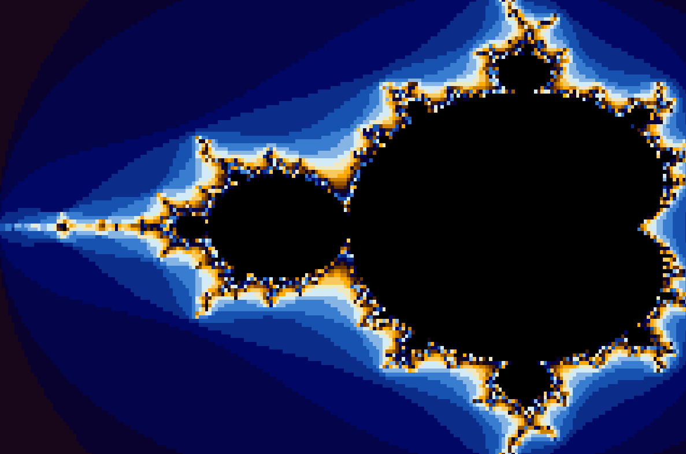

# Shaderbrot

Playing around with Fragment Shaders over a Mandelbrot plot. C / Raylib



## How to run

1. Ensure [raylib](https://www.raylib.com/) is installed
2. ```bash
   make
   ./shaderbrot
   ```

## Resources

- https://www.raylib.com/examples/shaders/loader.html?name=shaders_postprocessing
- https://en.wikipedia.org/wiki/Mandelbrot_set

## TODO

- Create more shaders and test them out
- Add capability to easily swap between shaders
